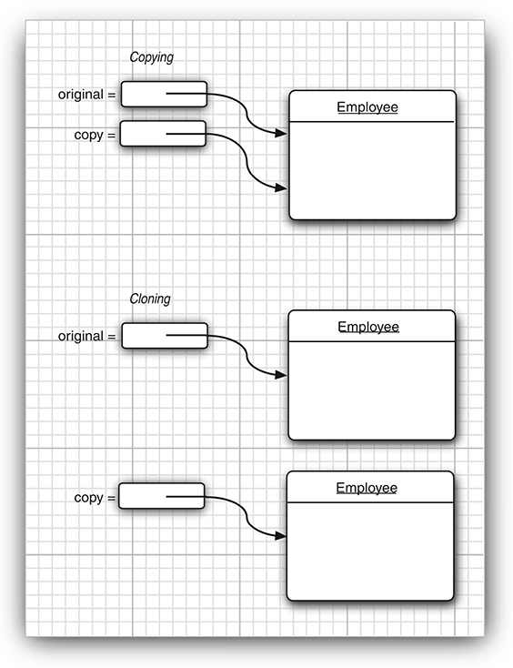
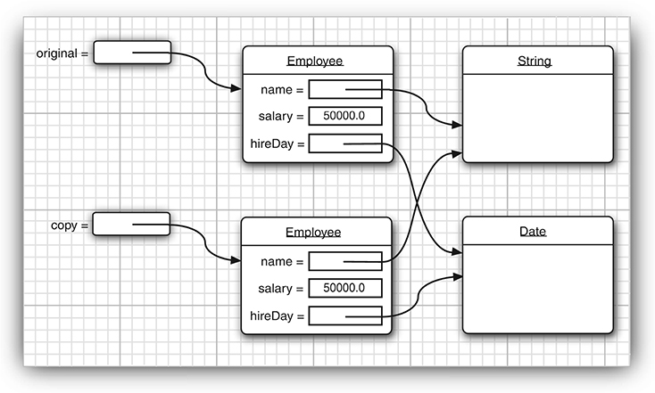

# Interface

* An interface is a set of requirements for the classes that want to conform to the interface.

```java
public interface Comparable
{
   int compareTo(Object other);
}
```

* This means that any class that implements the Comparable interface is required to have a compareTo method, and the method must take an Object parameter and return an integer.
* Generic Version of Comparable Interface as of Java 5
```java
public interface Comparable<T>
{
   int compareTo(T other); // parameter has type T
}
```

* All methods of an interface are automatically public.
* Interfaces never have instance fields.

* Supplying instance fields and methods that operate on them is the job of the classes that implement the interface.

```java
class Employee implements Comparable{
    public int compareTo(Object otherObject){
       Employee other = (Employee) otherObject;
       return Double.compare(salary, other.salary);
    }
    ...
}
```

```java
class Employee implements Comparable<Employee>
{
   public int compareTo(Employee other)
   {
      return Double.compare(salary, other.salary);
   }
   . . .
}
```

* In the interface declaration, the compareTo method was not declared public because all methods in an interface are automatically public. However, when implementing the interface, you must declare the method as public.

---

* The compareTo method of the Comparable interface returns an integer. If the objects are not equal, it does not matter what negative or positive value you return.
    * This flexibility can be useful when you are comparing integer fields. For example, suppose each employee has a unique integer id and you want to sort by the employee ID number. Then you can simply return id - other.id. That value will be some negative value if the first ID number is less than the other, 0 if they are the same ID, and some positive value otherwise.
    * The range of the integers must be small enough so that the subtraction does not overflow. (Integer.MAX_VALUE - 1) / 2
    * Otherwise, call the static Integer.compare method.
* For floating-point numbers. 
  * The difference salary - other.salary can round to 0 if the salaries are close together but not identical. 
  * The call Double.compare(x, y) simply returns -1 if x < y or 1 if x > y.
  
* The documentation of the Comparable interface suggests that the compareTo method should be compatible with the equals method. 
    * That is, x.compareTo(y) should be zero exactly when x.equals(y).
    * Most classes in the Java API that implement Comparable follow this advice. 
        * A notable exception is **BigDecimal**. 
        * Consider x = new BigDecimal("1.0") and y = new BigDecimal("1.00"). 
        * Then x.equals(y) is false because the numbers differ in precision. But x.compareTo(y) is zero.

---


----

* As with the equals method, problems can arise when inheritance comes into play.
    * x.compareTo(y) must throw an exception if y.compareTo(x) throws an exception.
    ```java
    class Manager extends Employee
    {
       public int compareTo(Employee other)
       {
          Manager otherManager = (Manager) other; // NO
          . . .
       }
       . . .
    }
    ```
    * That violates the “antisymmetry” rule. If x is an Employee and y is a Manager, then the call x.compareTo(y) doesn’t throw an exception—it simply compares x and y as employees. But the reverse, y.compareTo(x), throws a ClassCastException.
* If subclasses have different notions of comparison, then you should outlaw comparison of objects that belong to different classes. 
    * Each compareTo method should start out with the test
       ```java
         if (getClass() != other.getClass()) throw new ClassCastException();
       ```
    * If there is a common algorithm for comparing subclass objects, simply provide a single compareTo method in the superclass and declare it as final.
    * For example, suppose you want managers to be better than regular employees, regardless of salary. 
        * What about other subclasses such as Executive and Secretary? 
        * If you need to establish a pecking order, supply a method such as rank in the Employee class. 
        * Have each subclass override rank, and implement a single compareTo method that takes the rank values into account.
    
---

## Properties of Interfaces

* Even though you can’t construct interface objects, you can still declare interface variables.
    ```java
    Comparable x; // OK
    ```
    * An interface variable must refer to an object of a class that implements the interface:
    ```java
    x = new Employee(. . .); // OK provided Employee implements Comparable
    ```
* Next, just as you use instanceof to check whether an object is of a specific class, you can use instanceof to check whether an object implements an interface:
    ```java
    if (anObject instanceof Comparable) { . . . }
    ```
* Just as you can build hierarchies of classes, you can extend interfaces. 
    * This allows for multiple chains of interfaces that go from a greater degree of generality to a greater degree of specialization.
        ```
        public interface Moveable
        {
           void move(double x, double y);
        }
        ```
        ```
        public interface Powered extends Moveable
        {
           double milesPerGallon();
        }
        ```
* Although you cannot put instance fields in an interface, you can supply constants in them.
    * Just as methods in an interface are automatically public, fields are always public static final.
    ```
    public interface Powered extends Moveable
    {
       double milesPerGallon();
       double SPEED_LIMIT = 95; // a public static final constant
    }
    ``` 
* While each class can have only one superclass, classes can implement multiple interfaces. 
    ```
    class Employee implements Cloneable, Comparable
    ```
    
## Static and Private Methods

* As of Java 8, you are allowed to add static methods to interfaces.

* When you implement your own interfaces, there is no longer a reason to provide a separate companion class for utility methods.

* As of Java 9, methods in an interface can be private. 
    * A private method can be static or an instance method. 
    * Since private methods can only be used in the methods of the interface itself, their use is limited to being helper methods for the other methods of the interface.

```java
public interface Path
{
   public static Path of(URI uri) { . . . }
   public static Path of(String first, String... more) { . . . }
   . . .
}
```

## Default Methods
You can supply a default implementation for any interface method. You must tag such a method with the default modifier.

```java
public interface Comparable<T> 
{
   default int compareTo(T other) { return 0; }
      // by default, all elements are the same
}
```

```
public interface Iterator<E>
{
   boolean hasNext();
   E next();
   default void remove() { throw new UnsupportedOperationException("remove"); }
   . . .
}
```

* A default method can call other methods.

```
public interface Collection
{
   int size(); // an abstract method
   default boolean isEmpty() { return size() == 0; }
   . . .
}
```
* Then a programmer implementing Collection doesn’t have to worry about implementing an isEmpty method.

---

* The Collection interface in the Java API does not actually do this. 
  * Instead, there is a class AbstractCollection that implements Collection and defines isEmpty in terms of size. 
  * Implementors of a collection are advised to extend AbstractCollection. 
  
* That technique is obsolete. 

* Just implement the methods in the interface.
---

An important use for default methods is interface evolution. 

* Consider, for example, the Collection interface that has been a part of Java for many years. Suppose that a long time ago, you provided a class
    ```java
    public class Bag implements Collection
    ```
    * Later, in Java 8, a stream method was added to the interface.
    
    * Suppose the stream method was not a default method. 
    
    * Then the Bag class would no longer compile since it doesn’t implement the new method. 
    
    * Adding a nondefault method to an interface is not source-compatible.
    
    * But suppose you don’t recompile the class and simply use an old JAR file containing it. 
    
    * The class will still load, even with the missing method.
    
    * Making the method a default method solves problems. 
  
---

### Resolving Default Method Conflicts

What happens if the exact same method is defined as a default method in one interface and then again as a method of a superclass or another interface?

Here they are:

1. Superclasses win. If a superclass provides a concrete method, default methods with the same name and parameter types are simply ignored.

2. Interfaces clash. If an interface provides a default method, and another interface contains a method with the same name and parameter types (default or not), then you must resolve the conflict by overriding that method.

#### Let's first look at the Rule 2 Explanation

```
interface Person
{
   default String getName() { return ""; };
}
interface Named
{
   default String getName() { return getClass().getName() + "_" + hashCode(); }
}
```

* What happens if you form a class that implements both of them?

```
class Student implements Person, Named { . . . }
```

*  Simply provide a getName method in the Student class. In that method, you can choose one of the two conflicting methods, like this
    
    ```
    class Student implements Person, Named 
    {
       public String getName() { return Person.super.getName(); }
       . . .
    }
    ```

#### Now, Let's look at Rule 1 Explanation

```java
class Student extends Person implements Named { . . . }
```

* In that case, only the superclass method matters, and any default method from the interface is simply ignored. 
    * In our example, Student inherits the getName method from Person, and it doesn’t make any difference whether the Named interface provides a default for getName or not. 
    * This is the “class wins” rule.  
    
## The Comparator Interface

Now suppose we want to sort strings by increasing length, not in dictionary order. We can’t have the String class implement the compareTo method in two ways—and at any rate, the String class isn’t ours to modify.

To deal with this situation, there is a second version of the Arrays.sort method whose parameters are an array and a comparator—an instance of a class that implements the Comparator interface.

```
public interface Comparator<T> 
{
   int compare(T first, T second);
}
```
* To compare strings by length, define a class that implements Comparator<String>: 
```java
class LengthComparator implements Comparator<String> 
{
   public int compare(String first, String second) 
   {
      return first.length() - second.length();
   }
}
```
* To actually do the comparison, you need to make an instance:
    ```java
    var comp = new LengthComparator();
    if (comp.compare(words[i], words[j]) > 0) . . .
    ```
    * Even though the LengthComparator object has no state, you still need to make an instance of it. You need the instance to call the compare method—it is not a static method.
    * To sort an array, pass a LengthComparator object to the Arrays.sort method:
    ```
    String[] friends = { "Peter", "Paul", "Mary" };
    Arrays.sort(friends, new LengthComparator());
    ```

## Object Cloning
Cloneable interface indicates that a class has provided a safe clone method.

* To understand what cloning means, recall what happens when you make a copy of a variable holding an object reference.
 
    
 
 ```java
 var original = new Employee("John Public", 50000);
 Employee copy = original;
 copy.raiseSalary(10); // oops--also changed original
 ```
 
 ```java
 Employee copy = original.clone();
 copy.raiseSalary(10); // OK--original unchanged
 ```
 
 * But it isn’t quite so simple. 
 
 * The clone method is a protected method of Object, which means that your code cannot simply call it.
 * To visualize that, consider the Employee class
    * As you can see, the default cloning operation is “shallow”—it doesn’t clone objects that are referenced inside other objects.
    
    * If the subobject shared between the original and the shallow clone is immutable, then the sharing is safe. 
    * Quite frequently, however, subobjects are mutable, and you must redefine the clone method to make a deep copy that clones the subobjects as well.

* For every class, you need to decide whether
    1. The default clone method is good enough;

    2. The default clone method can be patched up by calling clone on the mutable subobjects; or

    3. clone should not be attempted.
 
* The third option is actually the default. To choose either the first or the second option, a class must
    1. Implement the **Cloneable interface**; and
      
    2. Redefine the clone method with the public access modifier.

---

 * The clone method is declared protected in the Object class, so that your code can’t simply call anObject.clone(). But aren’t protected methods accessible from any subclass, and isn’t every class a subclass of Object? 
    * Fortunately, the rules for protected access are more subtle. 
    * A subclass can call a protected clone method only to clone its own objects. 
    * You must redefine clone to be public to allow objects to be cloned by any method.

---

* Cloneable interface does not specify the clone method—that method is inherited from the Object class. 
    * The interface merely serves as a tag, indicating that the class designer understands the cloning process. 
    * Objects are so paranoid about cloning that they generate a checked exception if an object requests cloning but does not implement that interface.

* The Cloneable interface is one of a handful of tagging interfaces that Java provides. (Some programmers call them marker interfaces.)
    * A tagging interface has no methods; its only purpose is to allow the use of instanceof in a type inquiry:
        ```java
        if (obj instanceof Cloneable) . . .
        ```
        
* Even if the default (shallow copy) implementation of clone is adequate, you still need to implement the Cloneable interface, redefine clone to be public, and call super.clone().
    ```
    class Employee implements Cloneable
    {
       // public access, change return type
       public Employee clone() throws CloneNotSupportedException
       {
          return (Employee) super.clone();
       }
       . . .
    }
    ```
    * The clone method that you just saw adds no functionality to the shallow copy provided by Object.clone.
* To make a deep copy, you have to work harder and clone the mutable instance fields.
    ```java
    class Employee implements Cloneable
    {
       . . .
       public Employee clone() throws CloneNotSupportedException
       {
          // call Object.clone()
          Employee cloned = (Employee) super.clone();
          // clone mutable fields
          cloned.hireDay = (Date) hireDay.clone();
          return cloned;
       }
    }
    ```
    
 * The clone method of the Object class threatens to throw a **CloneNotSupportedException**
    * It does that whenever clone is invoked on an object whose class does not implement the Cloneable interface. 
    * Of course, the Employee and Date classes implement the Cloneable interface, so the exception won’t be thrown. 
    * However, the compiler does not know that. Therefore, we declared the exception
       ```
       public Employee clone() throws CloneNotSupportedException
       ```
 * Should you implement clone in your own classes? 
    * If your clients need to make deep copies, then you probably should.
    * Less than 5 percent of the classes in the standard library implement clone.
 
 * All array types have a clone method that is public, not protected. 
    *You can use it to make a new array that contains copies of all elements. For example:
    ```
     int[] luckyNumbers = { 2, 3, 5, 7, 11, 13 };
     int[] cloned = luckyNumbers.clone();
     cloned[5] = 12; // doesn't change luckyNumbers[5]; 
    ```
 