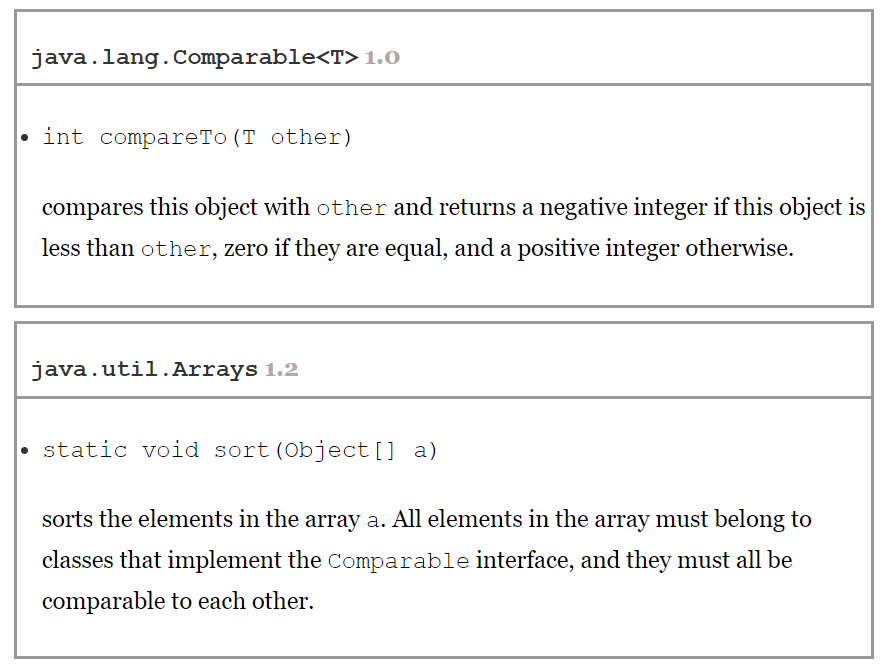
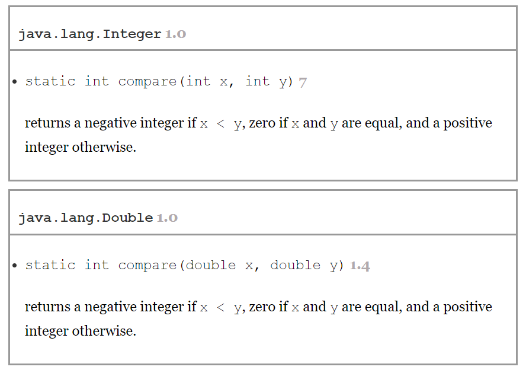

# Interface

* An interface is a set of requirements for the classes that want to conform to the interface.

```java
public interface Comparable
{
   int compareTo(Object other);
}
```

* This means that any class that implements the Comparable interface is required to have a compareTo method, and the method must take an Object parameter and return an integer.
* Generic Version of Comparable Interface as of Java 5
```java
public interface Comparable<T>
{
   int compareTo(T other); // parameter has type T
}
```

* All methods of an interface are automatically public.
* Interfaces never have instance fields.

* Supplying instance fields and methods that operate on them is the job of the classes that implement the interface.

```java
class Employee implements Comparable{
    public int compareTo(Object otherObject){
       Employee other = (Employee) otherObject;
       return Double.compare(salary, other.salary);
    }
    ...
}
```

```java
class Employee implements Comparable<Employee>
{
   public int compareTo(Employee other)
   {
      return Double.compare(salary, other.salary);
   }
   . . .
}
```

* In the interface declaration, the compareTo method was not declared public because all methods in an interface are automatically public. However, when implementing the interface, you must declare the method as public.

---

* The compareTo method of the Comparable interface returns an integer. If the objects are not equal, it does not matter what negative or positive value you return.
    * This flexibility can be useful when you are comparing integer fields. For example, suppose each employee has a unique integer id and you want to sort by the employee ID number. Then you can simply return id - other.id. That value will be some negative value if the first ID number is less than the other, 0 if they are the same ID, and some positive value otherwise.
    * The range of the integers must be small enough so that the subtraction does not overflow. (Integer.MAX_VALUE - 1) / 2
    * Otherwise, call the static Integer.compare method.
* For floating-point numbers. 
  * The difference salary - other.salary can round to 0 if the salaries are close together but not identical. 
  * The call Double.compare(x, y) simply returns -1 if x < y or 1 if x > y.
  
* The documentation of the Comparable interface suggests that the compareTo method should be compatible with the equals method. 
    * That is, x.compareTo(y) should be zero exactly when x.equals(y).
    * Most classes in the Java API that implement Comparable follow this advice. 
        * A notable exception is **BigDecimal**. 
        * Consider x = new BigDecimal("1.0") and y = new BigDecimal("1.00"). 
        * Then x.equals(y) is false because the numbers differ in precision. But x.compareTo(y) is zero.

---




----

* As with the equals method, problems can arise when inheritance comes into play.
    * x.compareTo(y) must throw an exception if y.compareTo(x) throws an exception.
    ```java
    class Manager extends Employee
    {
       public int compareTo(Employee other)
       {
          Manager otherManager = (Manager) other; // NO
          . . .
       }
       . . .
    }
    ```
    * That violates the “antisymmetry” rule. If x is an Employee and y is a Manager, then the call x.compareTo(y) doesn’t throw an exception—it simply compares x and y as employees. But the reverse, y.compareTo(x), throws a ClassCastException.
* If subclasses have different notions of comparison, then you should outlaw comparison of objects that belong to different classes. 
    * Each compareTo method should start out with the test
       ```java
         if (getClass() != other.getClass()) throw new ClassCastException();
       ```
    * If there is a common algorithm for comparing subclass objects, simply provide a single compareTo method in the superclass and declare it as final.
    * For example, suppose you want managers to be better than regular employees, regardless of salary. 
        * What about other subclasses such as Executive and Secretary? 
        * If you need to establish a pecking order, supply a method such as rank in the Employee class. 
        * Have each subclass override rank, and implement a single compareTo method that takes the rank values into account.
    
---

## Properties of Interfaces

* Even though you can’t construct interface objects, you can still declare interface variables.
    ```java
    Comparable x; // OK
    ```
    * An interface variable must refer to an object of a class that implements the interface:
    ```java
    x = new Employee(. . .); // OK provided Employee implements Comparable
    ```
* Next, just as you use instanceof to check whether an object is of a specific class, you can use instanceof to check whether an object implements an interface:
    ```java
    if (anObject instanceof Comparable) { . . . }
    ```
* Just as you can build hierarchies of classes, you can extend interfaces. 
    * This allows for multiple chains of interfaces that go from a greater degree of generality to a greater degree of specialization.
        ```
        public interface Moveable
        {
           void move(double x, double y);
        }
        ```
        ```
        public interface Powered extends Moveable
        {
           double milesPerGallon();
        }
        ```
* Although you cannot put instance fields in an interface, you can supply constants in them.
    * Just as methods in an interface are automatically public, fields are always public static final.
    ```
    public interface Powered extends Moveable
    {
       double milesPerGallon();
       double SPEED_LIMIT = 95; // a public static final constant
    }
    ```
* While each class can have only one superclass, classes can implement multiple interfaces. 
    ```
    class Employee implements Cloneable, Comparable
    ```
    
