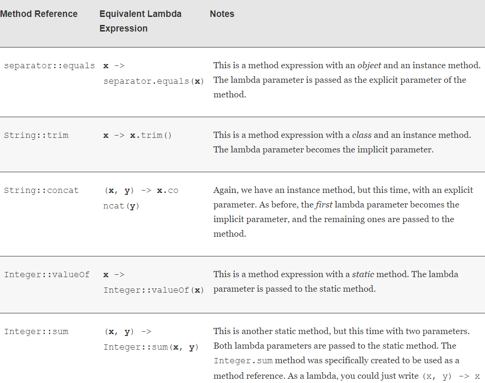
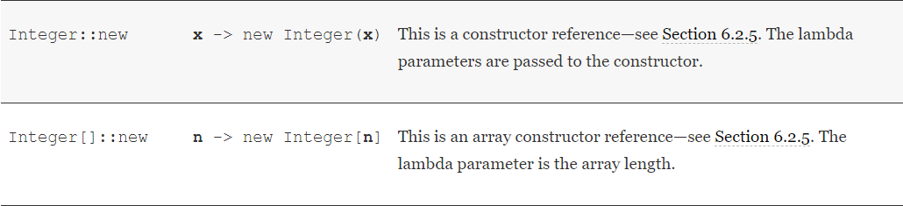

# Method References

Sometimes, a lambda expression involves a single method. 

* For example, suppose you simply want to print the event object whenever a timer event occurs.Of course, you could call
    ```java
    var timer = new Timer(1000, event -> System.out.println(event));
    ```
    * It would be nicer if you could just pass the println method to the Timer constructor. Here is how you do that:
    ```
    var timer = new Timer(1000, System.out::println);
    ```
* The expression **System.out::println** is a method reference.
    * It directs the compiler to produce an instance of a functional interface, overriding the single abstract method of the interface to call the given method.
    * In this example, an ActionListener is produced whose actionPerformed(ActionEvent e) method calls System.out.println(e).

> Like a lambda expression, a method reference is not an object. It gives rise to an object when assigned to a variable whose type is a functional interface.

* Now suppose we assign the same method reference to a different functional interface:
  ```java
  Runnable task = System.out::println;
  ```  
    * The Runnable functional interface has a single abstract method with no parameters
  
      ```java 
      void run()
      ```
      
    * In this case, the println() method with no parameters is chosen. 
    * Calling task.run() prints a blank line to System.out.   
    
* As another example, suppose you want to sort strings regardless of letter case. You can pass this method expression:
    ```java
    Arrays.sort(words, String::compareToIgnoreCase);
    ```
    * As you can see from these examples, the :: operator separates the method name from the name of an object or class.
    * There are three variants:
        1. object::instanceMethod
        
        2. Class::instanceMethod
        
        3. Class::staticMethod
        
* In the first variant, 
    * The method reference is equivalent to a lambda expression whose parameters are passed to the method. 
    * In the case of System.out::println, the object is System.out, and the method expression is equivalent to 
      ```java
      System.out::println
      // same as
      x -> System.out.println(x)
      ```

* In the second variant, 
    * the first parameter becomes the implicit parameter of the method. 
    * For example, 
        ```java
      String::compareToIgnoreCase
       // same as 
       (x, y) -> x.compareToIgnoreCase(y) 
        ```

* In the third variant, 
    * all parameters are passed to the static method: 
        ```java 
        Math::pow 
        //is equivalent to 
        (x, y) -> Math.pow(x, y)
        ```



> Note that a lambda expression can only be rewritten as a method reference if the body of the lambda expression calls a single method and doesn’t do anything else.
```
s -> s.length() == 0

// There is a single method call. 
// But there is also a comparison, so you can’t use a method reference here.
```

> When there are multiple overloaded methods with the same name, the compiler will try to find from the context which one you mean. 
<br><br>For example, there are two versions of the Math.max method, one for integers and one for double values. Which one gets picked depends on the method parameters of the functional interface to which Math::max is converted. 
<br><br>Just like lambda expressions, method references don’t live in isolation. They are always turned into instances of functional interfaces.

> Sometimes, the API contains methods that are specifically intended to be used as method references. 
<br><br>For example, the Objects class has a method isNull to test whether an object reference is null. 
<br><br>At first glance, this doesn’t seem useful because the test obj == null is easier to read than Objects.isNull(obj). 
<br><br>But you can pass the method reference to any method with a Predicate parameter. 
<br><br>For example, to remove all null references from a list, you can call 
```
   list.removeIf(Objects::isNull);
     // A bit easier to read than list.removeIf(e -> e == null);
 ``` 

* There is a tiny difference between a method reference with an object and its equivalent lambda expression. 
    * Consider a method reference such as separator::equals. 
    * If separator is null, forming separator::equals immediately throws a NullPointerException. 
    * The lambda expression x -> separator.equals(x) only throws a NullPointerException if it is invoked.
  
* You can capture the this parameter in a method reference. For example, 
```java 
this::equals 
// is the same as 
x -> this.equals(x). 
```

* It is also valid to use super. The method expression 
    ```java
    super::instanceMethod
    ```
    * uses this as the target and invokes the superclass version of the given method.
* Example: When the RepeatedGreeter.greet method starts, a Timer is constructed that executes the super::greet method on every timer tick.

```java
class Greeter
{
   public void greet(ActionEvent event)
   {
      System.out.println("Hello, the time is " 
         + Instant.ofEpochMilli(event.getWhen()));
   }
}
   
class RepeatedGreeter extends Greeter
{
   public void greet(ActionEvent event)
   {
      var timer = new Timer(1000, super::greet);
      timer.start();
   }
}
```

