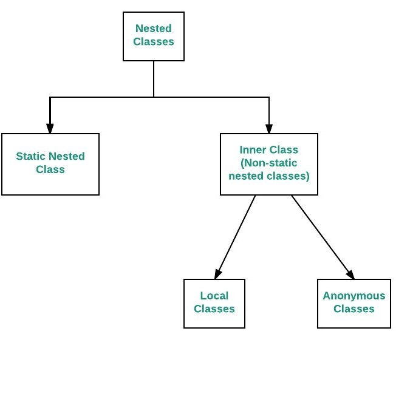

# Nested Classes

```java
class OuterClass
{
...
    class NestedClass
    {
        ...
    }
}

```
* In java, it is possible to define a class within another class, such classes are known as nested classes.
* They enable you to logically group classes that are only used in one place, thus this increases the use of encapsulation, and create more readable and maintainable code.

* The scope of a nested class is bounded by the scope of its enclosing class.
    * Thus in above example, class NestedClass does not exist independently of class OuterClass.
* A nested class has access to the members, including private members, of the class in which it is nested. 
    * However, reverse is not true i.e. the enclosing class does not have access to the members of the nested class.
* A nested class is also a member of its enclosing class.
    * As a member of its enclosing class, a nested class can be declared private, public, protected, or package private(default).
* Nested classes are divided into two categories:
    * static nested class : Nested classes that are declared static are called static nested classes.
    * inner class : An inner class is a non-static nested class.


## Static Nested Classes

* As with class methods and variables, a static nested class is associated with its outer class. 
    * And like static class methods, a static nested class cannot refer directly to instance variables or methods defined in its enclosing class: it can use them only through an object reference.

* They are accessed using the enclosing class name.
```java
OuterClass.StaticNestedClass
```

* For example, to create an object for the static nested class, use this syntax:
    ```java
    OuterClass.StaticNestedClass nestedObject =
         new OuterClass.StaticNestedClass();
    ```

```java
// Java program to demonstrate accessing  
// a static nested class 
  
// outer class 
class OuterClass 
{  
    // static member 
    static int outer_x = 10; 
      
    // instance(non-static) member 
    int outer_y = 20; 
      
    // private member 
    private static int outer_private = 30; 
      
    // static nested class 
    static class StaticNestedClass 
    { 
        void display() 
        { 
            // can access static member of outer class 
            System.out.println("outer_x = " + outer_x); 
              
            // can access display private static member of outer class 
            System.out.println("outer_private = " + outer_private); 
              
            // The following statement will give compilation error 
            // as static nested class cannot directly access non-static membera 
            // System.out.println("outer_y = " + outer_y); 
          
        } 
    } 
} 
  
// Driver class 
public class StaticNestedClassDemo 
{ 
    public static void main(String[] args) 
    { 
        // accessing a static nested class 
        OuterClass.StaticNestedClass nestedObject = new OuterClass.StaticNestedClass(); 
          
        nestedObject.display();  
        // Output: 
        // outer_x = 10
        // outer_private = 30
          
    } 
} 

```

## Inner Classes

* To instantiate an inner class, you must first instantiate the outer class.
```java
OuterClass.InnerClass innerObject = outerObject.new InnerClass();
```

* There are two special kinds of inner classes :
    1. Local inner classes
    2. Anonymous inner classes

* Inner classes can not have static declarations.

```
// Java program to demonstrate accessing 
// a inner class 
  
// outer class 
class OuterClass 
{  
    // static member 
    static int outer_x = 10; 
      
    // instance(non-static) member 
    int outer_y = 20; 
      
    // private member 
    private int outer_private = 30; 
      
    // inner class 
    class InnerClass 
    { 
        void display() 
        { 
            // can access static member of outer class 
            System.out.println("outer_x = " + outer_x); 
              
            // can also access non-static member of outer class 
            System.out.println("outer_y = " + outer_y); 
              
            // can also access private member of outer class 
            System.out.println("outer_private = " + outer_private); 
          
        } 
    } 
} 
  
// Driver class 
public class InnerClassDemo 
{ 
    public static void main(String[] args) 
    { 
        // accessing an inner class 
        OuterClass outerObject = new OuterClass(); 
        OuterClass.InnerClass innerObject = outerObject.new InnerClass(); 
          
        innerObject.display(); 
       // Output:
       // outer_x = 10
       // outer_y = 20
       // outer_private = 30    
    } 
} 
```

### Difference between static and inner(non-static nested) classes

* Static nested classes do not directly have access to other members(non-static variables and methods) of the enclosing class because as it is static, it must access the non-static members of its enclosing class through an object. 
    * That is, it cannot refer to non-static members of its enclosing class directly. 
        * Because of this restriction, static nested classes are seldom used.

* Non-static nested classes (inner classes) has **access** to all members(static and non-static variables and methods, including private) of its outer class and may refer to them directly in the same way that other non-static members of the outer class do.
  

### Local Inner Classes

* Local Inner Classes are the inner classes that are defined inside a block. 

    * Generally this block is a method body, for loop, or an if clause.

    * Local Inner classes are not a member of any enclosing classes. 

        * They belong to the block they are defined within, due of which local inner classes **cannot have any access modifiers** associated with them. 

            * However, they can be marked as final or abstract. 

* These class have access to the fields of the class enclosing it. 

* Local inner class must be instantiated in the block they are defined in.

#### Rules of Local Inner Class:

* The scope of local inner class is restricted to the block they are defined in.
* Local inner class cannot be instantiated from outside the block where it is created in.
* Till JDK 7,Local inner class can access only final local variable of the enclosing block. 
    * However From JDK 8, it is possible to access the non-final local variable of enclosing block in local inner class.
* A local class has access to the members of its enclosing class.
* Local inner classes can extend an abstract class or can also implement an interface.

#### Accessing Members

* A local inner class has access to fields of the class enclosing it as well as the fields of the block that it is defined within. 

* These classes, however, can access the variables or parameters of the block that encloses it only if they are declared as **final** or are **effectively final**. 
    * A variable whose value is not changed once initialized is called as effectively final variable. 
* A local inner class defined inside a method body, have access to it’s parameters.

#### What happens at compile time?

* When a program containing a local inner class is compiled, the compiler generate two .class files, one for the outer class and the other for the inner class that has the reference to the outer class. 

* The two files are named by compiler as:
```
Outer.class
Outer$1Inner.class
```

#### Local Inner Class Examples
````java
public class Outer 
 { 
     private void getValue() 
     { 
         // Note that local variable(sum) must be final till JDK 7  
         // hence this code will work only in JDK 8 
         int sum = 20; 
           
         // Local inner Class inside method 
         class Inner 
         { 
             public int divisor; 
             public int remainder; 
               
             public Inner() 
             { 
                 divisor = 4; 
                 remainder = sum%divisor; 
             } 
             private int getDivisor() 
             { 
                 return divisor; 
             } 
             private int getRemainder() 
             { 
                 return sum%divisor; 
             } 
             private int getQuotient() 
             { 
                 System.out.println("Inside inner class"); 
                 return sum / divisor; 
             } 
         } 
           
         Inner inner = new Inner(); 
         System.out.println("Divisor = "+ inner.getDivisor()); 
         System.out.println("Remainder = " + inner.getRemainder()); 
         System.out.println("Quotient = " + inner.getQuotient()); 
     } 
       
     public static void main(String[] args) 
     { 
         Outer outer = new Outer(); 
         outer.getValue(); 
     } 
 } 
````

````java
public class Outer 
 { 
     public int data = 10; 
     public int getData() 
     { 
         return data; 
     } 
     public static void main(String[] args) 
     { 
         Outer outer = new Outer(); 
           
         if(outer.getData() < 20) 
         { 
             // Local inner class inside if clause 
             class Inner 
             { 
                 public int getValue() 
                 { 
                     System.out.println("Inside Inner class"); 
                     return outer.data; 
                 } 
             } 
    
             Inner inner = new Inner(); 
             System.out.println(inner.getValue()); 
         } 
         else
         { 
             System.out.println("Inside Outer class"); 
         } 
     } 
 } 
````

### Anonymous Inner Classes

* It is an inner class without a name and for which only a single object is created. 

* An anonymous inner class can be useful when making an instance of an object with certain “extras” such as overloading methods of a class or interface, without having to actually subclass a class.

* Anonymous inner classes are useful in writing implementation classes for listener interfaces in graphics programming.

* Anonymous inner class are mainly created in two ways:
    * Class (may be abstract or concrete)
    * Interface

````java
// Test can be interface,abstract/concrete class
Test t = new Test() 
{
   // data members and methods
   public void test_method() 
   {
      ........
      ........
    }   
};
````

*  The syntax of an anonymous class expression is like the invocation of a constructor, except that there is a class definition contained in a block of code.

* To understand anonymous inner class, let us take a simple program

````java
//Java program to demonstrate need for Anonymous Inner class 
 interface Age 
 { 
     int x = 21; 
     void getAge(); 
 } 
 class AnonymousDemo 
 { 
     public static void main(String[] args)  
     { 
         // Myclass is implementation class of Age interface 
         MyClass obj=new MyClass(); 
   
         // calling getage() method implemented at Myclass 
         obj.getAge();      
     } 
 } 
   
 // Myclass implement the methods of Age Interface 
 class MyClass implements Age 
 { 
     @Override
     public void getAge()  
     { 
         // printing the age 
         System.out.print("Age is "+x); 
     } 
 } 
````

* In the program, interface Age is created with getAge() method and x=21.  
    * Myclass is written as implementation class of Age interface. 
    * As done in Program, there is no need to write a  separate class Myclass. 
    * Instead,   directly copy the code of Myclass into this parameter, as shown here:
        *  Such a class is called ‘anonymous inner class’, so here we call ‘Myclass’ as anonymous inner class.
````java
//Java program to demonstrate Anonymous inner class 
 interface Age 
 { 
     int x = 21; 
     void getAge(); 
 } 
 class AnonymousDemo 
 { 
     public static void main(String[] args) { 
   
         // Myclass is hidden inner class of Age interface 
         // whose name is not written but an object to it  
         // is created. 
         Age oj1 = new Age() { 
             @Override
             public void getAge() { 
                  // printing  age 
                 System.out.print("Age is "+x); 
             } 
         }; 
         oj1.getAge(); 
     } 
 } 
````

#### Types of anonymous inner class

* Based on declaration and behavior, there are 3 types of anonymous Inner classes:

1. Anonymous Inner class that extends a class

2. Anonymous Inner class that implements a interface

3. Anonymous Inner class that defines inside method/constructor argument

#### Difference between Normal/Regular class and Anonymous Inner class

* A normal class can implement any number of interfaces but anonymous inner class can implement only one interface at a time.

* A regular class can extend a class and implement any number of interface simultaneously. 
    * But anonymous Inner class can extend a class or can implement an interface but not both at a time.
* For regular/normal class, we can write any number of constructors but we cant write any constructor for anonymous Inner class 
    * Because anonymous class does not have any name and while defining constructor class name and constructor name must be same.
 
 #### Accessing Local Variables of the Enclosing Scope, and Declaring and Accessing Members of the Anonymous Class
 
Like local classes, anonymous classes can capture variables; they have the same access to local variables of the enclosing scope:
 
* An anonymous class has access to the members of its enclosing class.

* An anonymous class cannot access local variables in its enclosing scope that are not declared as final or effectively final.

* Like a nested class, a declaration of a type (such as a variable) in an anonymous class shadows any other declarations in the enclosing scope that have the same name.
  
 Anonymous classes also have the same restrictions as local classes with respect to their members
 
* We cannot declare static initializers or member interfaces in an anonymous class.

* An anonymous class can have static members provided that they are constant variables.

Note that you can declare the following in anonymous classes:

* Fields
* Extra methods (even if they do not implement any methods of the supertype)
* Instance initializers
* Local classes

However, constructors can not be declared in an anonymous class.