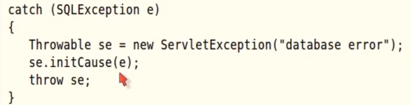

# Exceptions

* Use initCause method to embed one exception into the other one so that you convert it to another type without loosing original one.



* Cause of the exception can be retrieved with getCause method.

## Try Catch Finally

* finally clause used for closing resources but there exists some situations like throwing exception in finally block , so the best way is to use try with resources always to close resources.
````java
try{
    
}catch{
    
}finally{
    
}
````

## Try With Resources

* Resource must be AutoClosable
   
    * Opened resources always gets closed starting from last one even if inside try block no exception thrown. 

    * No matter what crazy exceptions occur, resources will be closed in this way. 
        * Some crazy ones like here in this example the possibility of PrintWriter's constructor throws exception, scan still closes.
````java
try(Scanner scan = new Scanner(Paths.get("in.txt", "UTF-8") );
    PrintWriter out = new PrintWriter("out.txt")
    ){
        while(scan.hasNext())
            out.println(scan.next().toUpperCase());
}catch(){
    
}finally(){
    // you still can use finally clause
}
````

* You can use effective final variables inside resources
    * So you don't have to declare variables inside parentheses.
````java
// don't for get to document that after this method finished
// PrintWriter will be closed
void print(PrintWriter out, String[] lines){
    try(out){   // effective final variable
        // 
    }
}
````

## Handling Exceptions

In most situations if you don't know how exactly handle the exceptioon, you should let the exception happen and don't handle it, just propagate it to the calling method.

There is just one situation where you may need to put a try catch close even though you don't really know what to do.
* When you override a method that's declared to throw no checked exceptions, you should handle it 

## Multiple Exceptions in a Catch Clause 

````java
try{
    // code that might throw exception
}catch(FileNotFoundException | UnknownHostException e){
    // emergency action for missing files and unknown host
}catch(IOException e){
    // emergency action for io problems
}
````

## Notes

* When catching exception, sort your exceptions from more specific to more general one.

* You can print the stack trace whenever you catch an exception that doesn't terminate the program.
    ````java
    ///...
    catch(Exception e){
        e.printStackTrace();
    }   
    ````
    * You can save it to somewhere else   
    
        ````java
          StringWriter out = new StringWriter();
          e.printStackTrace(new PrintWriter(out));
          String description = out.toString();
        ```` 
* Ex, Printing stack frames while calculating factorial
````java
public static int factorial(int n){
        System.out.println( "factorial(" + n + "):");
        Throwable t = new Throwable();
        StackTraceElement[] frames = t.getStackTrace();
        for(StackTraceElement f : frames)
            System.out.println(f);

        if(n == 0)
            return 1;
    
    return n * factorial(n-1);
}
````